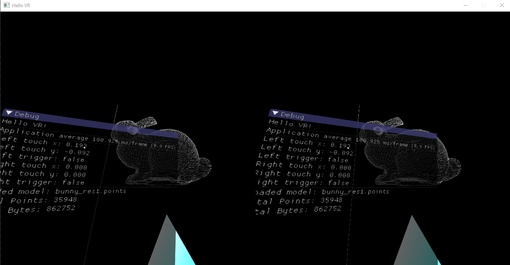

# Vive Input Test

Wrapping OpenVR im some more freindly classes for getting input and such. Uses Dear ImGui to render some debug UI.

Uses:

- OpenVR 1.0.5
- SDL 2.0.5
- GLEW 2.0.0
- GLM 0.9.8.3
- Dear ImGui 1.50 WIP (customised, embedded)

